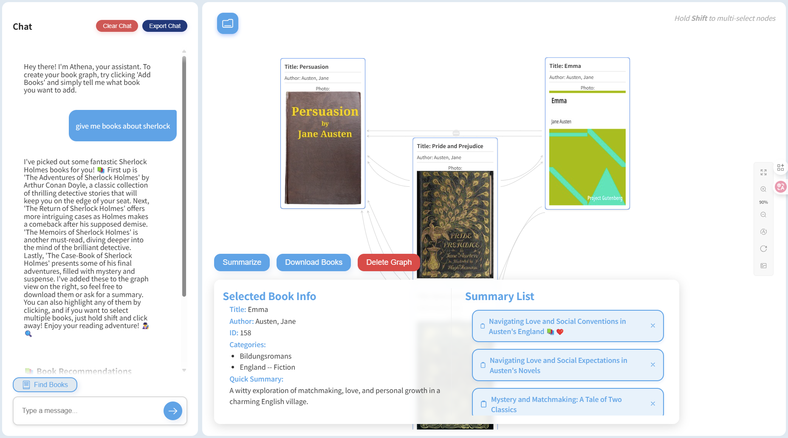
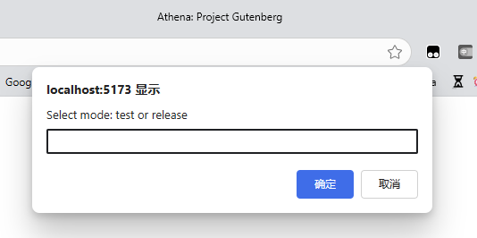

# Project Gutenberg: A Conversational AI for Personalized Book Discovery and Exploration in Digital Libraries



## Overview

Project Gutenberg is a conversational AI application designed to enhance the experience of discovering and exploring books in digital libraries. The project leverages Vue.js to create an interactive and user-friendly interface, enabling users to engage with a virtual assistant for personalized book recommendations and information.

## Features

- **Conversational Interface**: Interact with the AI to receive tailored book recommendations and detailed information.
- **Book Information Display**: View comprehensive details about selected books, including title, author, and cover image.
- **Interactive Relation Graph**: Explore connections between books through a visual representation of relationships.
- **Real-time Updates**: Experience dynamic interface updates based on user interactions.

## Installation

1. Clone the repository:
    ```sh
    git clone https://github.com/Xuyk021/PPGP.git
    ```
2. Navigate to the project directory:
    ```sh
    cd PPGP
    ```
3. Install dependencies:
    ```sh
    npm install
    ```
4. Start the development server:
    ```sh
    npm run dev
    ```

1. Navigate to the `backend_temp_for_books_storage` directory:
    ```sh
    cd backend_temp_for_books_storage
    ```
2. Install Express:
    ```sh
    npm install express
    ```
3. Run the backend server:
    ```sh
    node server.js
    ```

## Usage

- Open the application in your browser.
- Use the chat interface to interact with the AI and receive book recommendations.
- Click on nodes in the relation graph to explore book connections and view detailed information.

## License

This project is not allowed to be used for any purpose.

## Acknowledgements

- [Vue.js](https://vuejs.org/)
- [Project Gutenberg](https://www.gutenberg.org/)
- [Relation Graph Vue3](https://github.com/relation-graph-vue3)

## New Updates

### 20250723: Add packages
```sh
npm install element-plus
```
Press Ctrl+K to reveal the hidden "Change View" panel in the top-left corner.


### 20250813: Add test and release mode


Type "test" would go to the test mode, which would get 3 feedback from the backend.

Type "release" would go to the release mode, which would get 6 feedback from the backend.